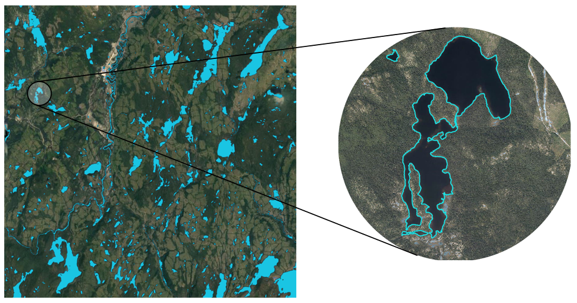

 
[](https://travis-ci.com/Jean-Romain/lidRplugins)
[](https://codecov.io/gh/Jean-Romain/lidRplugins?branch=master)

This package contains functions and algorithms to extend the [lidR](https://github.com/Jean-Romain/lidR) package (versions >= 3.1). These functions or algorithms are not yet or will not be included in the `lidR` package either because they are:

- :microscope: **Experimental** and not supported by a peer-reviewed and accessible publications.
- :zap: **Non suitable for `lidR`**  usually because they are not sufficiently efficient. 
- :warning: **Not tested enought** and I'm not sure they are sufficiently robust.
- :octocat: **Require extra packages** available on github but not on CRAN

This package will NOT be submitted on CRAN and must be installed from github. It depends on `lidR (>= 3.1.0)` and should be seen as a laboratory with more or less interesting content inside.  

## Features

### Lake delineation :microscope:

Lake delineation from point cloud using `delineate_lakes()`



### Powerline segmentation :microscope: :warning:

Powerline segmentation from point cloud using `find_transmissiontowers()`, `classify_transmissiontowers()`, `classify_wires()`, `track_wires()`


### Tile boundaries :octocat:

LAS files records the bounding boxes of the point cloud. `catalog_boundaries()` computes their actual boundaries.


### Various tree detection/segmentation from peer-reviewed papers :zap:

- `ptree()`: Vega, C., Hamrouni, a., El Mokhtari, S., Morel, J., Bock, J., Renaud, J.-P., … Durrieu, S. (2014). PTrees: A point-based approach to forest tree extraction from lidar data. International Journal of Applied Earth Observation and Geoinformation, 33, 98–108. https://doi.org/10.1016/j.jag.2014.05.001
- `hamraz2016()`: Hamraz, H., Contreras, M. A., & Zhang, J. (2016). A robust approach for tree segmentation in deciduous forests using small-footprint airborne LiDAR data. International Journal of Applied Earth Observation and Geoinformation, 52, 532–541. https://doi.org/10.1016/j.cageo.2017.02.017
- `LayerStacking()`: Ayrey, E., Fraver, S., Kershaw, J. A., Kenefic, L. S., Hayes, D., Weiskittel, A. R., & Roth, B. E. (2017). Layer Stacking: A Novel Algorithm for Individual Forest Tree Segmentation from LiDAR Point Clouds. Canadian Journal of Remote Sensing, 43(1), 16–27. https://doi.org/10.1080/07038992.2017.1252907
- `multichm()`: Eysn, L., Hollaus, M., Lindberg, E., Berger, F., Monnet, J. M., Dalponte, M., … Pfeifer, N. (2015). A benchmark of lidar-based single tree detection methods using heterogeneous forest data from the Alpine Space. Forests, 6(5), 1721–1747. https://doi.org/10.3390/f6051721

### Parameter free tree detection :microscope:

`lmfauto()` is a fast algorithm for individual tree detection with 0 parameters designed to process thousands of square kilometres without supervision.

### Additionnal ground classification algorithms :octocat:

- `mcc()` : Evans, Jeffrey S.; Hudak, Andrew T. 2007. A multiscale curvature algorithm for classifying discrete return LiDAR in forested environments. IEEE Transactions on Geoscience and Remote Sensing. 45(4): 1029-1038.

## Installation

```r
remotes::install_github("Jean-Romain/lidRplugins")
```

To install the package from github make sure you have a working development environment.

* **Windows**: Install [Rtools.exe](https://cran.r-project.org/bin/windows/Rtools/).  
* **Mac**: Install `Xcode` from the Mac App Store.
* **Linux**: Install the R development package, usually called `r-devel` or `r-base-dev`
